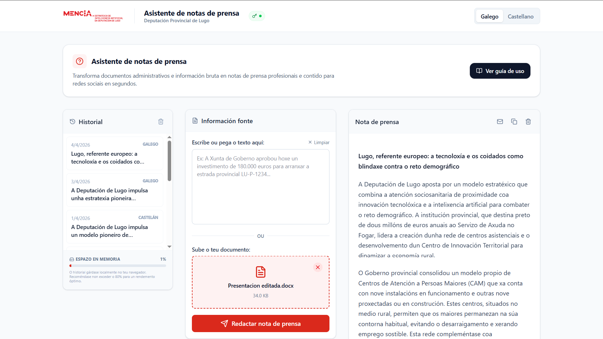

# 📝 Asistente de notas de prensa

<div align="center">





**Herramienta diseñada como prueba de concepto para el gabinete de comunicación de la Diputación de Lugo, que utiliza la API gratuita de Google Gemini (modelos Flash) para la redacción de borradores de notas de prensa y contenido para redes sociales.**

[🚀 Características](#-características) · [🏗️ Arquitectura](#️-arquitectura) · [🤖 Estilo de redacción](#-estilo-de-redacción-y-entrenamiento) · [🌍 Soporte multiidioma](#-soporte-multiidioma) · [⚡ Instalación y puesta en marcha](#-instalación-y-puesta-en-marcha)

</div>

---

> **Nota:** Este proyecto demuestra la viabilidad de crear herramientas de productividad avanzadas utilizando metodologías de **Vibe Coding** (Inteligencia Artificial Generativa), acelerando radicalmente el ciclo de desarrollo desde la idea al despliegue.

---

## 🎯 ¿Qué es el Asistente de notas de prensa?

El **Asistente de Notas de Prensa** es una aplicación web moderna que transforma información bruta, documentos administrativos, actas o informes técnicos en borradores de notas de prensa con un estilo periodístico profesional en cuestión de segundos.

La aplicación está diseñada específicamente para agilizar el trabajo diario del Gabinete de Comunicación, permitiendo generar no solo la nota de prensa principal, sino también sus correspondientes adaptaciones optimizadas para diferentes redes sociales (Instagram, Facebook y X).

> [!NOTE]
> **Aviso de privacidad:** Todo el procesamiento de texto se realiza a través de la API de Google Gemini. Asegúrese de no introducir información confidencial o datos personales sensibles no anonimizados en la herramienta.

---

## 🤖 Estilo de redacción y entrenamiento

Una de las características más destacadas de esta aplicación es su capacidad para **emular el estilo de escritura del Gabinete de Comunicación de la Diputación de Lugo**. 

El modelo de Inteligencia Artificial que impulsa la herramienta ha sido cuidadosamente instruido y contextualizado basándose en el análisis de **más de 100 noticias reales publicadas en la página web oficial de la institución**. Esto garantiza que el tono, la estructura, el vocabulario y el enfoque periodístico de los textos generados se alineen perfectamente con la línea editorial de la Diputación.

---

## 📌  Características

- 📝 **Generación inteligente** — Redacción de borradores de notas de prensa a partir de texto libre o documentos subidos (PDF, Word, TXT).
- 📱 **Adaptación estratégica a Redes Sociales** — Creación automática de posts optimizados para Instagram, Facebook y X con tono narrativo y mejores prácticas de cada plataforma.
- 🔐 **Privacidad "Bring Your Own Key" (BYOK)** — Configuración segura de la API Key de Gemini directamente desde la interfaz de la aplicación, sin necesidad de archivos de configuración externos.
- 🧵 **Reglas avanzadas para RRSS** — Formateo automático de hilos para X (Twitter) respetando límites de caracteres y optimización de emojis.
- #️⃣ **Banco de Hashtags** — Generación de hashtags relevantes con funcionalidad de copiado rápido con un solo clic.
- 🌍 **Traducción instantánea** — Cambio fluido entre Gallego y Castellano sin necesidad de regenerar el contenido desde cero gracias a un sistema de caché inteligente.
- 💡 **Títulos alternativos** — Sugerencia de múltiples opciones de titulares atractivos para cada nota de prensa.
- 🗂️ **Historial local** — Guardado automático de los trabajos anteriores en el navegador para poder recuperarlos en cualquier momento.
- 🎨 **Diseño premium UI/UX** — Interfaz limpia, accesible y totalmente adaptativa (responsive) para escritorio y dispositivos móviles.

---

## 🏗️ Arquitectura

```
press-release-assistant/
├── src/                        # Código fuente principal
│   ├── App.tsx                 # Componente principal y lógica de la aplicación
│   ├── main.tsx                # Punto de entrada de React
│   ├── index.css               # Estilos globales y configuración de Tailwind
│   ├── lib/                    # Utilidades y funciones auxiliares
│   │   └── utils.ts            # Función cn() para clases de Tailwind
│   └── components/             # Componentes UI (Radix UI, etc.)
│
├── public/                     # Recursos estáticos
├── package.json                # Dependencias y scripts
├── tailwind.config.js          # Configuración de Tailwind CSS
├── vite.config.ts              # Configuración del bundler Vite
└── tsconfig.json               # Configuración de TypeScript
```

---

## 🌍 Soporte multiidioma

La aplicación está diseñada para trabajar de forma nativa en los dos idiomas oficiales de la comunidad:

| Idioma | Estado | Uso |
|--------|--------|-----|
| 🏴󠁧󠁢󠁥󠁮󠁧󠁿 Gallego | ✅ Completo | Idioma principal de la interfaz y generación por defecto. |
| 🇪🇸 Castellano | ✅ Completo | Traducción instantánea de la interfaz y del contenido generado. |

---

## 🤖 Desarrollo asistido por IA (Vibe Coding)

Este ecosistema ha sido desarrollado íntegramente mediante **AI-Driven Development**, orquestando modelos avanzados de lenguaje (LLMs) para la arquitectura, lógica y diseño. El flujo de trabajo ha incluido:

1.  **Arquitectura React + Vite:** Diseño de una estructura rápida y escalable en una aplicación de página única (SPA).
2.  **Ingeniería de Prompts (Prompt Engineering):** Creación de instrucciones complejas para que la API de Gemini actúe como un redactor institucional experto, aplicando las directrices de estilo de la Deputación de Lugo.
3.  **UI/UX Premium con Tailwind & Radix UI:** Creación de una interfaz fluida, accesible y con un diseño moderno.
4.  **Gestión de estado avanzada:** Implementación de caché de traducciones e historial persistente en `localStorage`.

---

## 🛠️ Stack tecnológico

| Tecnología | Uso |
|---|---|
| **React 18** | Librería de interfaz de usuario |
| **Vite** | Entorno de desarrollo y bundler ultrarrápido |
| **TypeScript** | Tipado estático para código robusto |
| **TailwindCSS** | Sistema de diseño utility-first |
| **Google Gemini API** | Motor de Inteligencia Artificial (`@google/genai`) |
| **Mammoth** | Extracción de texto desde documentos Word (.docx) |
| **Lucide React** | Iconografía moderna y consistente |
| **Radix UI** | Componentes accesibles sin estilo (Tabs, Dialogs) |

---

## ⚡ Instalación y puesta en marcha

### Prerrequisitos
- **Node.js** `>= 18.x`
- **npm** `>= 9.x`
- **Clave de API de Google Gemini**

### Pasos

1. **Clona el repositorio**
   ```bash
   git clone <url-del-repositorio>
   cd press-release-assistant
   ```

2. **Instala las dependencias**
   ```bash
   npm install
   ```

3. **Inicia el servidor de desarrollo**
   ```bash
   npm run dev
   ```

La aplicación estará disponible en **[http://localhost:3000](http://localhost:3000)**. La primera vez que accedas, una ventana modal solicitará tu clave de API de Gemini y la guardará de forma segura en el almacenamiento local de tu navegador.

---

## 🤖 Personalización del estilo de redacción

Esta aplicación está configurada por defecto para emular el estilo del Gabinete de Comunicación de la **Diputación de Lugo**. Si deseas adaptar esta herramienta a las necesidades de otra institución, empresa o entidad, el elemento clave a modificar es la constante `SYSTEM_INSTRUCTION` situada en el archivo `src/App.tsx`.

### Cómo replicar el estilo de tu propia institución

Para conseguir que la IA escriba con el tono, la estructura y el vocabulario específico de tu organización, recomendamos seguir este proceso de "ingeniería de estilo" utilizando **NotebookLM** de Google:

1. **Recopilación de fuentes:** Identifica entre 50 y 100 notas de prensa reales publicadas por tu entidad que representen tu "estilo ideal".
   *   *Consejo para el scraping:* Si no quieres recopilar las URLs a mano, puedes usar herramientas como **Browse AI**, **Octoparse** o extensiones de navegador como **Web Scraper** para extraer automáticamente las URLs de las noticias de tu sitio web. Alternativamente, si tienes acceso a un agente de navegación (como por ejemplo Comet de Perplexity), puedes pedirle: *"Visita la web [URL_DE_TU_ENTIDAD] y navega por las páginas de paginación para listar las URLs de las 100 noticias más recientes. Devuélveme el listado en un markdown que contenga unicamente las urls en líneas separadas."*
2. **Creación del cuaderno:** Abre [NotebookLM](https://notebooklm.google.com/) y crea un nuevo cuaderno de notas.
3. **Carga de datos:** Añade las URLs de las noticias seleccionadas como fuentes del cuaderno.
4. **Extracción del ADN de redacción:** Una vez procesadas las fuentes, introduce el siguiente prompt en el chat de NotebookLM:

> "Actúa como un experto en comunicación institucional y análisis lingüístico. Analiza todas las fuentes proporcionadas y extrae un conjunto detallado de directrices que definan fielmente el estilo de redacción de esta entidad. El objetivo es crear una instrucción de sistema (System Prompt) para un modelo de lenguaje.
> 
> Incluye en tu análisis:
> - **Tono y voz:** ¿Es formal, cercano, técnico, institucional?
> - **Estructura:** ¿Cómo son los titulares? ¿Qué información va en la entradilla? ¿Cómo se organiza el cuerpo?
> - **Tratamiento de autoridades:** ¿Cómo se refieren a los cargos (Presidente/a, Diputados/as, Alcalde/esa, Concejal/a etc.)?
> - **Vocabulario:** Palabras recurrentes, conectores preferidos y términos prohibidos o a evitar (jerga administrativa, etc.).
> - **Reglas específicas:** Patrones detectados en el uso de negritas, longitud de párrafos o cierre de noticias.
> 
> Presenta el resultado como una lista de instrucciones claras, directas y estructuradas."

5. **Implementación:** Copia el análisis resultante y sustituye el contenido de la constante `SYSTEM_INSTRUCTION` en `src/App.tsx`. Ten en cuenta que el estilo original está redactado en gallego; si tu entidad opera en otro idioma, ajusta las instrucciones para que la IA genere el contenido directamente en el idioma deseado. Automáticamente, la aplicación empezará a generar contenidos siguiendo tu nueva línea editorial.

---

## 📄 Uso

Este proyecto es de uso interno para la optimización de los flujos de trabajo del gabinete de comunicación. No obstante cualquiera puede clonar el repositorio y adaptar el estilo de escritura a sus necesidades.

---

## 🤝 Contribuciones

Las contribuciones son bienvenidas. Si deseas proponer mejoras en los prompts de generación o añadir nuevas funcionalidades, abre un *Issue* o envía un *Pull Request*.

---

## 📜 Licencia

Este proyecto está bajo la Licencia **MIT**. Consulta el archivo [LICENSE](./LICENSE) incluido en el repositorio para más detalles.

---

## 👨‍💻 Autor

**Jose Antonio Arias Lombardero**
*Experto en Inteligencia Artificial aplicada al sector público, innovación, contratación y fondos europeos.*

Esta aplicación forma parte de un portfolio de soluciones tecnológicas conceptualizadas, desarrolladas y desplegadas en entornos cloud para su aplicación en el sector público. Mi objetivo es demostrar cómo el uso estratégico de modelos avanzados de IA (Vibe Coding) puede escalar radicalmente la digitalización, la operatividad y la alfabetización tecnológica de la Administración.

🔗 [Consulta mi portfolio completo de aplicaciones y trayectoria profesional](https://ariaslombardero.es/)
